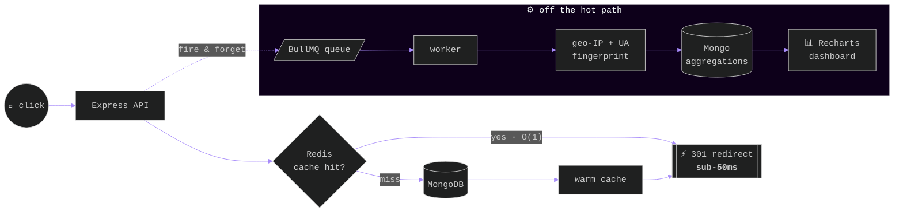

<!-- ═══════════════════════════════ HERO ═══════════════════════════════ -->

<div align="center">


&nbsp;&nbsp;


<br/>

<a href="https://kartik-portfolio-6k36.vercel.app/"></a>&nbsp;
<a href="https://www.linkedin.com/in/kartik-bhargava-248796257"></a>&nbsp;
<a href="mailto:kartikbhargava1111@gmail.com"></a>&nbsp;
<a href="https://github.com/Consoder?tab=repositories"></a>

</div>

<br/>

<!-- ═══════════════════════════════ 01 ABOUT ═══════════════════════════════ -->

<div align="center">


</div>

<table width="100%">
<tr>
<td width="55%" valign="top">

```typescript
const kartik = {
  location: "Jaipur, IN — remote-ready",
  education: "B.Tech CSE '27 · SKIT · 8.3 CGPA",

  languages: ["C++", "Python", "JavaScript", "SQL", "C"],
  backend:   ["Node", "Express", "FastAPI"],
  frontend:  ["React", "Next.js", "Tailwind"],
  data:      ["PostgreSQL", "MongoDB", "Redis"],
  infra:     ["Docker", "AWS", "GitHub Actions"],

  dsa: { solved: 385, medium: 181, hard: 34 },

  obsession: "systems where the hot path never blocks",
  hireable: true,
};
```

</td>
<td width="45%" valign="middle" align="center">


</td>
</tr>
</table>

<br/>

<!-- ═══════════════════════════════ 02 ARCHITECTURE ═══════════════════════════════ -->

<div align="center">


<br/><br/>
<samp>PULSE.IO — A REDIRECT THAT NEVER WAITS FOR ANALYTICS</samp>
</div>



<div align="center"><sup>Every click enqueues a BullMQ job — background workers do the heavy lifting, the redirect never blocks. <a href="https://github.com/Consoder/Pulse.io"><b>→ read the code</b></a></sup></div>

<br/>

<!-- ═══════════════════════════════ 03 PROJECTS ═══════════════════════════════ -->

<div align="center">


</div>

<table width="100%">
<tr>
<td width="33%" valign="top" align="center">

<h3>⚡ Pulse.io</h3>
<samp>LINK INTELLIGENCE ENGINE</samp>

<p align="left">Sub-50ms redirects (architecture ↑). JWT + Google OAuth, MongoDB aggregation pipelines for geo / device / campaign breakdowns, Recharts + Framer Motion dashboard.</p>

    

<a href="https://github.com/Consoder/Pulse.io"></a>

</td>
<td width="33%" valign="top" align="center">

<h3>🔍 Code Analysis Platform</h3>
<samp>AI CODE REVIEW · 7 LANGUAGES</samp>

<p align="left">Bug detection, Big-O analysis, quality scoring. Redis cache keyed on <b>SHA-256 of source</b> — repeat analysis drops from 2–8s to <b>~40ms</b>. JWT + OAuth, rate limiting, PostgreSQL.</p>

   

<a href="https://github.com/Consoder/ROASTCODE"></a>

</td>
<td width="33%" valign="top" align="center">

<h3>🚗 Vision Navigation</h3>
<samp>BEHAVIORAL CLONING CNN</samp>

<p align="left">NVIDIA-style end-to-end CNN, 4,500+ labeled frames → <b>121K params, 94.1% val accuracy</b>, real-time CPU inference. Pygame sim with <b>Grad-CAM</b> showing what the model watches while steering.</p>

   

<a href="https://github.com/Consoder/Vision-Based-Autonomous-Navigation-System"></a>

</td>
</tr>
</table>

<div align="center"><sub>ALSO — <a href="https://github.com/Consoder/saas-notes-app"><b>saas-notes-app</b></a> · multi-tenant API, JWT + RBAC &nbsp;/&nbsp; <a href="https://github.com/Consoder/SMS-IDENTIFIER"><b>SMS-IDENTIFIER</b></a> · TF-IDF spam classifier</sub></div>

<br/>

<!-- ═══════════════════════════════ 04 EXPERIENCE ═══════════════════════════════ -->

<div align="center">


</div>

<table width="100%">
<tr>
<td width="26%" align="center" valign="middle">


</td>
<td width="74%" valign="middle">

<b>Software Engineer — Full-Stack Intern</b> · Wisflux Pvt. Ltd<br/>
<sub>Secure REST APIs, auth/authorization & backend features for a scalable MERN link-management platform · Agile/Scrum · code reviews · performance optimization</sub>

</td>
</tr>
<tr>
<td width="26%" align="center" valign="middle">


</td>
<td width="74%" valign="middle">

<b>Python & Machine Learning Intern</b> · KisTechno Software Pvt. Ltd<br/>
<sub>End-to-end self-driving simulator — data collection, training, evaluation → 94%+ accuracy · Grad-CAM explainability added on mentor feedback</sub>

</td>
</tr>
</table>

<table width="100%">
<tr>
<td width="50%" align="center" valign="top">

<samp>🏆 HONOURS</samp><br/><br/>
🥈 IEEE Hackathon — <b>2nd Place</b><br/><sub>working prototype + go-to-market strategy</sub><br/><br/>
🎤 DevOps Workshop <b>Coordinator</b><br/><sub>100+ students</sub>

</td>
<td width="50%" align="center" valign="top">

<samp>📜 CREDENTIALS</samp><br/><br/>
☁️ AWS Cloud Practitioner Essentials<br/><sub>EC2 · S3 · VPC · IAM</sub><br/><br/>
✨ Google Vertex AI — Prompt Design &nbsp;·&nbsp; 📊 Deloitte Data Analytics

</td>
</tr>
</table>

<br/>

<!-- ═══════════════════════════════ 05 STACK ═══════════════════════════════ -->

<div align="center">


</div>

<table width="100%">
<tr>
<td align="center" width="20%"><samp>LANGUAGES</samp></td>
<td align="center"></td>
</tr>
<tr>
<td align="center"><samp>FRONTEND ×<br/>BACKEND</samp></td>
<td align="center"></td>
</tr>
<tr>
<td align="center"><samp>DATA</samp></td>
<td align="center"></td>
</tr>
<tr>
<td align="center"><samp>TOOLS ×<br/>CLOUD</samp></td>
<td align="center"></td>
</tr>
</table>

<div align="center"><sub><samp>CORE CS — DSA · OOP · DBMS · OPERATING SYSTEMS · COMPUTER NETWORKS · REST · CI/CD</samp></sub></div>

<br/>

<!-- ═══════════════════════════════ 06 TELEMETRY ═══════════════════════════════ -->

<div align="center">


<br/><br/>


<br/><br/>

&nbsp;

<br/><br/>

<!-- CONTRIBUTION SNAKE — powered by .github/workflows/snake.yml -->
<picture>
  <source media="(prefers-color-scheme: dark)" srcset="https://raw.githubusercontent.com/Consoder/Consoder/output/github-contribution-grid-snake-dark.svg"/>
  
</picture>

</div>

<br/>

<!-- ═══════════════════════════════ CONTACT ═══════════════════════════════ -->

<div align="center">


<a href="https://kartik-portfolio-6k36.vercel.app/"></a>&nbsp;
<a href="https://www.linkedin.com/in/kartik-bhargava-248796257"></a>&nbsp;
<a href="mailto:kartikbhargava1111@gmail.com"></a>

<br/><br/>


</div>
