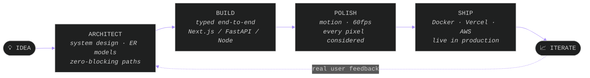
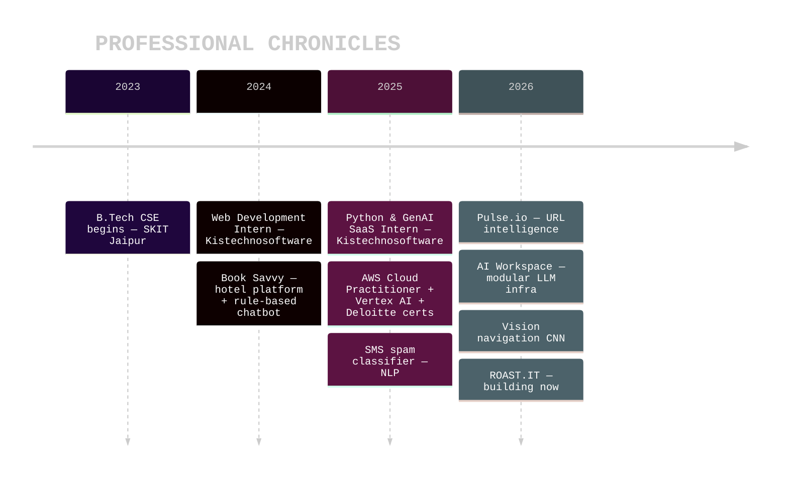

<!-- ═══════════════════════════ HERO ═══════════════════════════ -->

<div align="center">


<samp>LAT. 26.9124° N &nbsp;/&nbsp; LONG. 75.7873° E &nbsp;—&nbsp; JAIPUR, INDIA &nbsp;·&nbsp; BASE OF OPERATIONS &nbsp;·&nbsp; EST. 2023</samp>

<br/><br/>

<!-- KBD NAV — clickable -->
<kbd><a href="#about">&nbsp;⌘ ABOUT&nbsp;</a></kbd>&nbsp;
<kbd><a href="#work">&nbsp;⌁ SELECTED WORK&nbsp;</a></kbd>&nbsp;
<kbd><a href="#process">&nbsp;⚙ PROCESS&nbsp;</a></kbd>&nbsp;
<kbd><a href="#trajectory">&nbsp;⏣ TRAJECTORY&nbsp;</a></kbd>&nbsp;
<kbd><a href="#stack">&nbsp;✦ STACK&nbsp;</a></kbd>&nbsp;
<kbd><a href="#signal">&nbsp;⟡ SIGNAL&nbsp;</a></kbd>&nbsp;
<kbd><a href="#contact">&nbsp;◈ CONTACT&nbsp;</a></kbd>

<br/><br/>


</div>

<br/>

<div align="center"><samp>✦&nbsp;&nbsp;DIGITAL CRAFTSPERSON&nbsp;&nbsp;✦&nbsp;&nbsp;UI SYSTEMS & MOTION&nbsp;&nbsp;✦&nbsp;&nbsp;SCALABLE BACKENDS&nbsp;&nbsp;✦&nbsp;&nbsp;AGENTIC AI&nbsp;&nbsp;✦</samp></div>

<br/>

<!-- ═══════════════════════════ ABOUT ═══════════════════════════ -->

<a id="about"></a>

## <samp>01 — ABOUT</samp>


<samp>FULL-STACK PRODUCT ENGINEER</samp>

I'm **Kartik Bhargava** — B.Tech CSE '27 @ SKIT Jaipur. I build products from
idea to deployment: SaaS platforms, AI-powered tools, and production-ready
web systems.

I enjoy solving complex engineering problems, but I'm equally obsessed
with interfaces that feel **fast, intuitive, and effortless**.

Whether it's a scalable backend, a 2ms redirect path, or a 60fps
interaction — I care about one thing:

> <samp>**Building products people genuinely enjoy using.**</samp>

```text
STATUS      🟢 OPEN FOR OPPORTUNITIES — SWE / GenAI / Full-Stack internships
FOCUS       Agentic AI · LLM products · systems that don't block
DOCTRINE    Build fast. Ship clean. Make it real.
```

<br clear="right"/>

<div align="center"><samp>· · · ─────── ✦ ─────── · · ·</samp></div>

<!-- ═══════════════════════════ SELECTED WORK ═══════════════════════════ -->

<a id="work"></a>

## <samp>02 — SELECTED WORK</samp>

<samp>CURATED ARCHIVE — OPEN EACH CASE FILE ↓</samp>

<br/>

<details>
<summary>&nbsp;<b>◉ &nbsp;CASE 01 &nbsp;·&nbsp; NEXT-GEN AI WORKSPACE</b> &nbsp;—&nbsp; <samp>modular LLM infra · persistence · streaming</samp></summary>
<br/>

> A production-grade AI chat platform — not a tutorial clone. Real engineering patterns, at scale.

- **Resumable streams** — Redis-buffered SSE; browser drops mid-generation, reconnects, resumes from the exact offset without re-hitting the LLM
- **Multi-model routing** — 4 xAI Grok models behind one provider: chat / reasoning / titles / image gen, with reasoning-model tool isolation
- **Live artifacts** — text, code, image & spreadsheet documents stream into a side panel in real time, versioned via composite primary keys
- **Guest-first auth** — NextAuth v5, auto-provisioned guest sessions, timing-safe password checks, server-side rate limits
- **Tested & observable** — Playwright E2E suite + OpenTelemetry

<div align="center">

`Next.js 15` · `Vercel AI SDK v5` · `PostgreSQL + Drizzle` · `Redis` · `NextAuth v5` · `Playwright`

<kbd><a href="https://github.com/Consoder/AI-powered-developer-interaction-platform-with-persistence-and-modular-LLM-infra">&nbsp;→ OPEN REPOSITORY&nbsp;</a></kbd>

</div>
</details>

<details>
<summary>&nbsp;<b>◉ &nbsp;CASE 02 &nbsp;·&nbsp; PULSE.IO</b> &nbsp;—&nbsp; <samp>URL intelligence & analytics engine</samp></summary>
<br/>

> Zero-blocking architecture: the redirect never waits for the analytics.

- **~2ms redirect resolution** from an O(1) Redis cache — sub-50ms end-to-end
- **Fire-and-forget pipeline** — every click pushes a BullMQ job; background workers handle User-Agent + Geo-IP fingerprinting off the hot path
- **MongoDB aggregation pipelines** power device / OS / geo breakdowns
- **JWT + Bcrypt** auth, Recharts + Framer Motion dashboard at 60fps

<div align="center">

`React` · `Node.js + Express` · `MongoDB` · `BullMQ` · `Redis` · `Recharts`

<kbd><a href="https://github.com/Consoder/Pulse.io">&nbsp;→ OPEN REPOSITORY&nbsp;</a></kbd>

</div>
</details>

<details>
<summary>&nbsp;<b>◉ &nbsp;CASE 03 &nbsp;·&nbsp; VISION-BASED AUTONOMOUS NAVIGATION</b> &nbsp;—&nbsp; <samp>behavioral cloning · end-to-end CNN</samp></summary>
<br/>

> A self-driving car that learned to steer from raw pixels. No rules. No lane heuristics.

- **NVIDIA's end-to-end approach**, implemented from scratch in Python
- **Custom CNN** (`nvidia_e2e_gap`) — 5 Conv2D layers (24→36→48→64→64, ELU) into Global Average Pooling
- **Interactive simulator** — Pygame physics & rendering, TensorFlow/Keras as the brain
- Drive it yourself, record data, retrain, watch it improve

<div align="center">

`Python` · `TensorFlow / Keras` · `Pygame` · `NumPy` · `OpenCV`

<kbd><a href="https://github.com/Consoder/Vision-Based-Autonomous-Navigation-System">&nbsp;→ OPEN REPOSITORY&nbsp;</a></kbd>

</div>
</details>

<details>
<summary>&nbsp;<b>◉ &nbsp;CASE 04 &nbsp;·&nbsp; ROAST.IT</b> &nbsp;—&nbsp; <samp>persona-driven AI code review · accuracy-verified</samp></summary>
<br/>

> Code review with real personality — the humor changes with the persona; the technical verdict never does.

- **Strict persona/accuracy separation** — the model may only inject personality in one layer; reported bugs must be real
- Pick a reviewer persona, get feedback that's genuinely entertaining *and* genuinely correct
- Most active build right now — shipping weekly

<div align="center">

`JavaScript` · `LLM orchestration` · `prompt architecture`

<kbd><a href="https://github.com/Consoder/ROASTCODE">&nbsp;→ OPEN REPOSITORY&nbsp;</a></kbd>

</div>
</details>

<br/>

<sub>ALSO IN THE ARCHIVE — <a href="https://github.com/Consoder/saas-notes-app"><b>saas-notes-app</b></a> · multi-tenant SaaS API, JWT + RBAC + plan gating &nbsp;/&nbsp; <a href="https://github.com/Consoder/SMS-IDENTIFIER"><b>SMS-IDENTIFIER</b></a> · NLP spam classifier, TF-IDF + Streamlit &nbsp;/&nbsp; <a href="https://github.com/Consoder?tab=repositories">full index →</a></sub>

<br/>

<div align="center"><samp>· · · ─────── ✦ ─────── · · ·</samp></div>

<!-- ═══════════════════════════ PROCESS ═══════════════════════════ -->

<a id="process"></a>

## <samp>03 — HOW I SHIP</samp>



<br/>

<div align="center"><samp>· · · ─────── ✦ ─────── · · ·</samp></div>

<!-- ═══════════════════════════ TRAJECTORY ═══════════════════════════ -->

<a id="trajectory"></a>

## <samp>04 — TRAJECTORY</samp>



<details>
<summary><samp>&nbsp;⏣ EXPAND — INTERNSHIP DETAIL</samp></summary>
<br/>

**PYTHON, GENAI & FULL-STACK SAAS INTERN** — Kistechnosoftware · Remote — <samp>JUN–JUL 2025</samp>
- Engineered a multi-user GenAI SaaS platform: real-time AI messaging (OpenRouter API), JWT auth, persistent sessions on FastAPI
- Built a React 18 frontend with 3D UI (React Three Fiber) + full dark/light theming
- Modular FastAPI backend designed for cloud deployment — Docker, PostgreSQL
- Launched a Next.js 14 multi-LLM chatbot template

**WEB DEVELOPMENT INTERN** — Kistechnosoftware · On-site — <samp>JUL 2024</samp>
- Responsive pages with HTML/CSS/JS/Bootstrap 5 — mobile-first, UI/UX-aligned components

</details>

<br/>

<samp>**HONOURS —**</samp>&nbsp; 🥈 IEEE Hackathon **Runner-Up** &nbsp;·&nbsp; 🥈 GeeksforGeeks DSA Contest **Runner-Up** &nbsp;·&nbsp; 🥷 Code360 **Ninja Dominator** (top tier) &nbsp;·&nbsp; 🎤 DevOps Workshop **Lead** — 100+ attendees

<samp>**CREDENTIALS —**</samp>&nbsp; ☁️ AWS Cloud Quest: Cloud Practitioner &nbsp;·&nbsp; 🏗 AWS Solutions Architecture Job Simulation &nbsp;·&nbsp; ✨ Google Vertex AI — Prompt Design &nbsp;·&nbsp; 📊 Deloitte Data Analytics & Forensic Technology

<br/>

<div align="center"><samp>· · · ─────── ✦ ─────── · · ·</samp></div>

<!-- ═══════════════════════════ STACK ═══════════════════════════ -->

<a id="stack"></a>

## <samp>05 — THE ARSENAL</samp>

<div align="center">

<samp>LANGUAGES</samp>
<br/><br/>

<br/><br/>

<samp>INTERFACE & MOTION</samp>
<br/><br/>

<br/><br/>

<samp>SYSTEMS & APIS</samp>
<br/><br/>

<br/><br/>

<samp>AI / GENAI</samp>
<br/><br/>
<code>LangChain</code>&nbsp; <code>Vertex AI</code>&nbsp; <code>Gemini API</code>&nbsp; <code>OpenRouter</code>&nbsp; <code>Vercel AI SDK</code>&nbsp; <code>RAG pipelines</code>&nbsp; <code>Agentic workflows</code>
<br/><br/>

<samp>CLOUD & TOOLING</samp>
<br/><br/>


</div>

<br/>

<div align="center"><samp>· · · ─────── ✦ ─────── · · ·</samp></div>

<!-- ═══════════════════════════ SIGNAL ═══════════════════════════ -->

<a id="signal"></a>

## <samp>06 — THE SIGNAL</samp>

<div align="center">

&nbsp;


<!-- CONTRIBUTION SNAKE — requires the Action below, eats your graph daily -->
<picture>
  <source media="(prefers-color-scheme: dark)" srcset="https://raw.githubusercontent.com/Consoder/Consoder/output/github-contribution-grid-snake-dark.svg"/>
  <source media="(prefers-color-scheme: light)" srcset="https://raw.githubusercontent.com/Consoder/Consoder/output/github-contribution-grid-snake.svg"/>
  
</picture>

</div>

<br/>

<div align="center"><samp>✦&nbsp;&nbsp;CRAFTING OPULENCE&nbsp;&nbsp;✦&nbsp;&nbsp;ENGINEERED FOR IMPACT&nbsp;&nbsp;✦&nbsp;&nbsp;EVERY PIXEL CONSIDERED&nbsp;&nbsp;✦</samp></div>

<!-- ═══════════════════════════ CONTACT ═══════════════════════════ -->

<a id="contact"></a>

## <samp>07 — INITIALIZE TRANSMISSION</samp>

<div align="center">
<br/>

<samp>LET'S BUILD **SOMETHING REAL.**</samp>

<br/><br/>

<kbd><a href="https://kartik-portfolio-6k36.vercel.app/">&nbsp;⌘ &nbsp;THE STUDIO — PORTFOLIO&nbsp;</a></kbd>
&nbsp;&nbsp;
<kbd><a href="https://www.linkedin.com/in/kartik-bhargava-248796257">&nbsp;⟡ &nbsp;LINKEDIN&nbsp;</a></kbd>
&nbsp;&nbsp;
<kbd><a href="mailto:kartikbhargava1111@gmail.com">&nbsp;◈ &nbsp;EMAIL&nbsp;</a></kbd>

<br/><br/>

<samp>STATUS &nbsp;→&nbsp; 🟢 OPEN FOR OPPORTUNITIES<br/>
RESPONSE TIME &nbsp;→&nbsp; UNDER 24 HOURS<br/>
LOCATION &nbsp;→&nbsp; JAIPUR, INDIA · REMOTE-READY</samp>

<br/><br/>


<sub><samp>© 2026 KARTIK BHARGAVA — ALL RIGHTS RESERVED · CRAFTED WITH INTENT</samp></sub>

</div>
