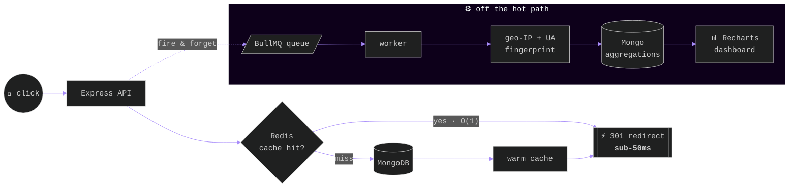

<!-- ════════════════════════════ BOOT SEQUENCE ════════════════════════════ -->

<div align="center">


<br/><br/>


<br/><br/>


<br/>

<kbd><a href="https://kartik-portfolio-6k36.vercel.app/">&nbsp;⌘ PORTFOLIO&nbsp;</a></kbd>&nbsp;&nbsp;
<kbd><a href="https://www.linkedin.com/in/kartik-bhargava-248796257">&nbsp;⟡ LINKEDIN&nbsp;</a></kbd>&nbsp;&nbsp;
<kbd><a href="mailto:kartikbhargava1111@gmail.com">&nbsp;◈ EMAIL&nbsp;</a></kbd>&nbsp;&nbsp;
<kbd><a href="#architecture">&nbsp;⚙ SEE THE ARCHITECTURE ↓&nbsp;</a></kbd>

<br/><br/>


</div>

<!-- ════════════════════════════ RUNTIME ════════════════════════════ -->

## <samp>~/kartik $ cat profile.ts</samp>


```typescript
const kartik = {
  location: "Jaipur, IN — remote-ready",
  education: "B.Tech CSE '27 · SKIT Jaipur · 8.3 CGPA",

  languages: ["C++", "Python", "JavaScript", "SQL", "C"],
  backend:   ["Node", "Express", "FastAPI", "REST"],
  frontend:  ["React", "Next.js", "Tailwind"],
  data:      ["PostgreSQL", "MongoDB", "Redis"],
  infra:     ["Docker", "AWS", "GitHub Actions"],

  dsa: { solved: 385, medium: 181, hard: 34 },

  obsession: "systems where the hot path never blocks",
  currentlyShipping: "AI code analysis platform",
  hireable: true,
};
```

<br clear="right"/>

<div align="center"><samp>─────── ✦ ───────</samp></div>

<!-- ════════════════════════════ ARCHITECTURE ════════════════════════════ -->

<a id="architecture"></a>

## <samp>~/kartik $ mermaid pulse.io --hot-path</samp>

<samp>MY FAVOURITE THING I'VE BUILT — A REDIRECT THAT NEVER WAITS FOR ANALYTICS</samp>



<sup>The redirect and the analytics never share a thread of fate — every click enqueues a BullMQ job, background workers do the heavy lifting. <a href="https://github.com/Consoder/Pulse.io"><b>→ read the code</b></a></sup>

<br/>

<div align="center"><samp>─────── ✦ ───────</samp></div>

<!-- ════════════════════════════ SELECTED WORK ════════════════════════════ -->

## <samp>~/kartik $ ls projects/ --sort=impact</samp>


<samp>THREE BUILDS · REAL METRICS · CODE IS PUBLIC — OPEN ANY REPO AND GRILL ME ON IT.</samp>

<br clear="right"/>

<table width="100%">
<tr>
<td width="33%" valign="top">

### ⚡ Pulse.io
<samp>LINK INTELLIGENCE ENGINE</samp>

Sub-50ms redirects (architecture ↑). JWT + Google OAuth, MongoDB aggregation pipelines powering geo / device / campaign breakdowns, Recharts + Framer Motion dashboard.

`React` `Node` `Express` `MongoDB` `Redis` `BullMQ`

<kbd><a href="https://github.com/Consoder/Pulse.io">→ REPO</a></kbd>

</td>
<td width="33%" valign="top">

### 🔍 Code Analysis Platform
<samp>AI CODE REVIEW · 7 LANGUAGES</samp>

Bug detection, Big-O analysis, quality scoring. Redis cache keyed on **SHA-256 of source** — repeat analysis drops from 2–8s to **~40ms**. JWT + OAuth, rate limiting, PostgreSQL.

`Next.js 14` `FastAPI` `Redis` `PostgreSQL`

<kbd><a href="https://github.com/Consoder/ROASTCODE">→ REPO</a></kbd>

</td>
<td width="33%" valign="top">

### 🚗 Vision Navigation
<samp>BEHAVIORAL CLONING CNN</samp>

NVIDIA-style end-to-end CNN, 4,500+ labeled frames → **121K params, 94.1% val accuracy**, real-time CPU inference. Pygame sim with **Grad-CAM** overlays showing what the model watches while steering.

`Python` `TensorFlow` `OpenCV` `Pygame`

<kbd><a href="https://github.com/Consoder/Vision-Based-Autonomous-Navigation-System">→ REPO</a></kbd>

</td>
</tr>
</table>

<sub>ALSO — <a href="https://github.com/Consoder/saas-notes-app"><b>saas-notes-app</b></a> · multi-tenant API, JWT + RBAC &nbsp;/&nbsp; <a href="https://github.com/Consoder/SMS-IDENTIFIER"><b>SMS-IDENTIFIER</b></a> · TF-IDF spam classifier &nbsp;/&nbsp; <a href="https://github.com/Consoder?tab=repositories">full index →</a></sub>

<br/>

<div align="center"><samp>─────── ✦ ───────</samp></div>

<!-- ════════════════════════════ EXPERIENCE ════════════════════════════ -->

## <samp>~/kartik $ git log --experience</samp>


```text
* commit 2026.05 → 2026.06  (HEAD)
│ role:    Software Engineer — Full-Stack Intern
│ org:     Wisflux Pvt. Ltd
│ work:    secure REST APIs, auth/authorization & backend features for a
│          MERN link-management platform · Agile/Scrum · code reviews ·
│          performance optimization
│
* commit 2025.05 → 2025.07
│ role:    Python & Machine Learning Intern
│ org:     KisTechno Software Pvt. Ltd
│ work:    end-to-end self-driving simulator — data collection, training,
│          evaluation → 94%+ accuracy · Grad-CAM explainability
```

<br clear="right"/>

<samp>**HONOURS**</samp> &nbsp;·&nbsp; 🥈 IEEE Hackathon — **2nd Place** (working prototype + go-to-market) &nbsp;·&nbsp; 🎤 DevOps Workshop **Coordinator** — 100+ students

<samp>**CREDENTIALS**</samp> &nbsp;·&nbsp; ☁️ AWS Cloud Practitioner Essentials &nbsp;·&nbsp; ✨ Google Vertex AI — Prompt Design &nbsp;·&nbsp; 📊 Deloitte Data Analytics

<br/>

<div align="center"><samp>─────── ✦ ───────</samp></div>

<!-- ════════════════════════════ STACK ════════════════════════════ -->

## <samp>~/kartik $ tree stack/</samp>

<div align="center">


<br/><br/>

<br/><br/>


<br/>

<sub><samp>CORE CS — DSA · OOP · DBMS · OPERATING SYSTEMS · COMPUTER NETWORKS · REST · CI/CD</samp></sub>

</div>

<br/>

<div align="center"><samp>─────── ✦ ───────</samp></div>

<!-- ════════════════════════════ TELEMETRY ════════════════════════════ -->

## <samp>~/kartik $ htop --github</samp>

<div align="center">


<br/><br/>

&nbsp;


<br/><br/>

<!-- CONTRIBUTION SNAKE — powered by .github/workflows/snake.yml in this repo -->
<picture>
  <source media="(prefers-color-scheme: dark)" srcset="https://raw.githubusercontent.com/Consoder/Consoder/output/github-contribution-grid-snake-dark.svg"/>
  
</picture>

</div>

<br/>

<!-- ════════════════════════════ CONTACT ════════════════════════════ -->

<div align="center">


<br/><br/>


<br/><br/>


<br/>

<kbd><a href="https://kartik-portfolio-6k36.vercel.app/">&nbsp;PORTFOLIO&nbsp;</a></kbd>&nbsp;&nbsp;
<kbd><a href="https://www.linkedin.com/in/kartik-bhargava-248796257">&nbsp;LINKEDIN&nbsp;</a></kbd>&nbsp;&nbsp;
<kbd><a href="mailto:kartikbhargava1111@gmail.com">&nbsp;KARTIKBHARGAVA1111@GMAIL.COM&nbsp;</a></kbd>

<br/><br/>


<br/><br/>

<sub><samp>© 2026 KARTIK BHARGAVA · $ exit 0</samp></sub>

<br/><br/>


</div>
