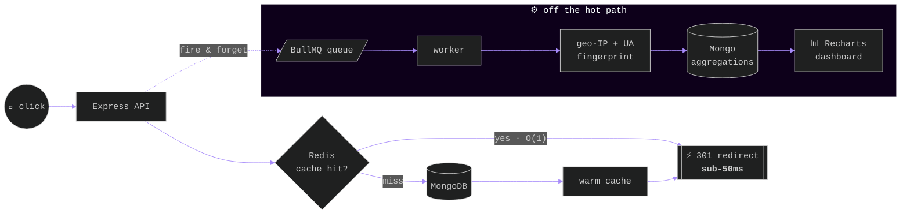

  <!-- ══════════════ MIDNIGHT ATELIER · design spec in DESIGN.md ══════════════ -->

<!-- ══════════════ 00 — HERO ARCHITECTURE ══════════════ -->
<div align="center">
  

  <br/><br/>

  
  
  
  
  

  <br/><br/>

  <a href="https://kartik-portfolio-6k36.vercel.app/"></a>&nbsp;
  <a href="https://www.linkedin.com/in/kartik-bhargava-248796257"></a>&nbsp;
  <a href="mailto:kartikbhargava1111@gmail.com"></a>&nbsp;
  <a href="https://github.com/Consoder?tab=repositories"></a>

</div>

<!-- ══════════════ 01 — THE ENGINEER ══════════════ -->
<h2 align="left">
  
</h2>

<table width="100%">
<tr>
<td width="55%" valign="top">

```typescript
const kartik = {
  location: "Jaipur, IN — remote-ready",
  education: "B.Tech CSE '27 · SKIT · 8.3 CGPA",

  languages: ["C++", "Python", "JavaScript", "SQL", "C"],
  backend:   ["Node", "Express", "FastAPI"],
  frontend:  ["React", "Next.js", "Tailwind"],
  data:      ["PostgreSQL", "MongoDB", "Redis"],
  infra:     ["Docker", "AWS", "GitHub Actions"],

  dsa: { solved: 385, medium: 181, hard: 34 },

  obsession: "systems where the hot path never blocks",
  hireable: true,
};
```

</td>
<td width="45%" valign="middle" align="center">


</td>
</tr>
</table>

<br/>

<!-- ══════════════ 02 — ARCHITECTURE ══════════════ -->




<div align="center"><sup>Every click enqueues a BullMQ job — workers do the heavy lifting off the hot path, so the redirect never waits for analytics. <a href="https://github.com/Consoder/Pulse.io"><b>→ read the code</b></a></sup></div>

<br/>

<!-- ══════════════ 03 — SELECTED WORK ══════════════ -->


<table width="100%">
<tr>
<td width="33%" valign="top">

<h3 align="center">⚡ Pulse.io</h3>
<p align="center"><sub><samp>LINK INTELLIGENCE ENGINE</samp></sub></p>

Sub-50ms redirects (architecture ↑). JWT + Google OAuth, MongoDB aggregation pipelines for geo / device / campaign breakdowns, Recharts + Framer Motion dashboard.

<p align="center"><code>React</code> <code>Node</code> <code>Express</code> <code>MongoDB</code> <code>Redis</code> <code>BullMQ</code></p>

<p align="center"><a href="https://github.com/Consoder/Pulse.io"><b>→ repository</b></a></p>

</td>
<td width="33%" valign="top">

<h3 align="center">🔍 Code Analysis Platform</h3>
<p align="center"><sub><samp>AI CODE REVIEW · 7 LANGUAGES</samp></sub></p>

Bug detection, Big-O analysis, quality scoring. Redis cache keyed on SHA-256 of source — repeat analysis drops from 2–8s to <b>~40ms</b>. JWT + OAuth, rate limiting, PostgreSQL.

<p align="center"><code>Next.js 14</code> <code>FastAPI</code> <code>Redis</code> <code>PostgreSQL</code></p>

<p align="center"><a href="https://github.com/Consoder/ROASTCODE"><b>→ repository</b></a></p>

</td>
<td width="33%" valign="top">

<h3 align="center">🚗 Vision Navigation</h3>
<p align="center"><sub><samp>BEHAVIORAL CLONING CNN</samp></sub></p>

NVIDIA-style end-to-end CNN, 4,500+ labeled frames → <b>121K params, 94.1% val accuracy</b>, real-time CPU inference. Pygame sim with Grad-CAM showing what the model watches while steering.

<p align="center"><code>Python</code> <code>TensorFlow</code> <code>OpenCV</code> <code>Pygame</code></p>

<p align="center"><a href="https://github.com/Consoder/Vision-Based-Autonomous-Navigation-System"><b>→ repository</b></a></p>

</td>
</tr>
</table>

<div align="center"><sub>ALSO — <a href="https://github.com/Consoder/saas-notes-app"><b>saas-notes-app</b></a> · multi-tenant API, JWT + RBAC &nbsp;/&nbsp; <a href="https://github.com/Consoder/SMS-IDENTIFIER"><b>SMS-IDENTIFIER</b></a> · TF-IDF spam classifier</sub></div>

<br/>

<!-- ══════════════ 04 — EXPERIENCE ══════════════ -->


<table width="100%">
<tr>
<td width="22%" align="center" valign="middle"><samp><b>MAY–JUN<br/>2026</b></samp></td>
<td width="78%" valign="middle">

<b>Software Engineer — Full-Stack Intern</b> · Wisflux Pvt. Ltd<br/>
<sub>Secure REST APIs, auth/authorization & backend features for a scalable MERN link-management platform · Agile/Scrum · code reviews · performance optimization</sub>

</td>
</tr>
<tr>
<td align="center" valign="middle"><samp><b>MAY–JUL<br/>2025</b></samp></td>
<td valign="middle">

<b>Python & Machine Learning Intern</b> · KisTechno Software Pvt. Ltd<br/>
<sub>End-to-end self-driving simulator — data collection, training, evaluation → 94%+ accuracy · Grad-CAM explainability added on mentor feedback</sub>

</td>
</tr>
</table>

<table width="100%">
<tr>
<td width="50%" align="center" valign="top">

<samp>HONOURS</samp>

🥈 IEEE Hackathon — <b>2nd Place</b><br/><sub>working prototype + go-to-market strategy</sub>

🎤 DevOps Workshop <b>Coordinator</b> — <sub>100+ students</sub>

</td>
<td width="50%" align="center" valign="top">

<samp>CREDENTIALS</samp>

☁️ AWS Cloud Practitioner Essentials<br/><sub>EC2 · S3 · VPC · IAM</sub>

✨ Google Vertex AI — Prompt Design · 📊 Deloitte Data Analytics

</td>
</tr>
</table>

<br/>

<!-- ══════════════ 05 — THE STACK ══════════════ -->


<table width="100%">
<tr>
<td align="center" width="22%"><samp>LANGUAGES</samp></td>
<td align="center"></td>
</tr>
<tr>
<td align="center"><samp>FRONTEND ×<br/>BACKEND</samp></td>
<td align="center"></td>
</tr>
<tr>
<td align="center"><samp>DATA</samp></td>
<td align="center"></td>
</tr>
<tr>
<td align="center"><samp>TOOLS × CLOUD</samp></td>
<td align="center"></td>
</tr>
</table>

<div align="center"><sub><samp>CORE CS — DSA · OOP · DBMS · OPERATING SYSTEMS · COMPUTER NETWORKS · REST · CI/CD</samp></sub></div>

<br/>

<!-- ══════════════ 06 — TELEMETRY ══════════════ -->


<div align="center">

&nbsp;

<br/><br/>

<!-- CONTRIBUTION SNAKE — powered by .github/workflows/snake.yml -->
<picture>
  <source media="(prefers-color-scheme: dark)" srcset="https://raw.githubusercontent.com/Consoder/Consoder/output/github-contribution-grid-snake-dark.svg"/>
  
</picture>

</div>

<br/>

<!-- ══════════════ SIGN-OFF ══════════════ -->

<div align="center">


<br/><br/>


<br/>

<a href="https://kartik-portfolio-6k36.vercel.app/"></a>&nbsp;
<a href="https://www.linkedin.com/in/kartik-bhargava-248796257"></a>&nbsp;
<a href="mailto:kartikbhargava1111@gmail.com"></a>

<br/><br/>


</div>
