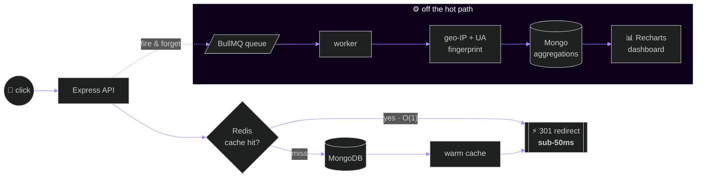

<!--
  TYPE SYSTEM (Google Fonts, rendered via readme-typing-svg)
  Display / section headers ...... Space Grotesk 700
  UI / card titles ............... Inter 700
  Technical / terminal accents ... JetBrains Mono 500   (same face as the ASCII portrait)

  COLOR ROLES
  #C9A876 gold ....... section headers only (top of hierarchy)
  #E8D5FF lavender ... card titles + name
  #A78BFA violet ..... supporting / mono text
  #1a0533 indigo ..... badge fills
-->

<table width="100%">
<tr>
<td width="440" align="center" valign="middle">


</td>
<td width="440" valign="middle">


<br/>


<br/>

<a href="https://kartik-portfolio-6k36.vercel.app/"></a>&nbsp;
<a href="https://www.linkedin.com/in/kartik-bhargava-248796257"></a>&nbsp;
<a href="mailto:kartikbhargava1111@gmail.com"></a>&nbsp;
<a href="https://github.com/Consoder?tab=repositories"></a>

</td>
</tr>
</table>


<br/>

<!-- ═════════════════════ 00 — SNAPSHOT ═════════════════════ -->

<h2>

</h2>

<table width="100%">
<tr>
<td width="60" align="center" valign="middle">🎯</td>
<td width="380" valign="middle">
<br/>
Systems where the hot path never blocks — cache first, queue the rest.
</td>
<td width="60" align="center" valign="middle">📍</td>
<td width="380" valign="middle">
<br/>
Jaipur, India — remote-ready.<br/>B.Tech CSE '27 · SKIT · 8.3 CGPA
</td>
</tr>
<tr><td colspan="4" height="18"></td></tr>
<tr>
<td width="60" align="center" valign="middle">🧮</td>
<td width="380" valign="middle">
<br/>


</td>
<td width="60" align="center" valign="middle">🚀</td>
<td width="380" valign="middle">
<br/>
Pulse.io · ROASTCODE · Vision-Nav<br/>Open to SDE / Full-Stack / Backend roles.
</td>
</tr>
</table>


<br/>

<!-- ═════════════════════ 01 — THE ENGINEER ═════════════════════ -->

<h2>

</h2>

<table width="100%">
<tr>
<td width="500" valign="top">

```typescript
const kartik = {
  location: "Jaipur, IN — remote-ready",
  education: "B.Tech CSE '27 · SKIT · 8.3 CGPA",

  languages: ["C++", "Python", "JavaScript", "SQL", "C"],
  backend:   ["Node", "Express", "FastAPI"],
  frontend:  ["React", "Next.js", "Tailwind"],
  data:      ["PostgreSQL", "MongoDB", "Redis"],
  infra:     ["Docker", "AWS", "GitHub Actions"],

  dsa: { solved: 385, medium: 181, hard: 34 },

  obsession: "systems where the hot path never blocks",
  hireable: true,
};
```

</td>
<td width="380" align="center" valign="middle">

</td>
</tr>
</table>


<br/>

<!-- ═════════════════════ 02 — THE ARCHITECTURE ═════════════════════ -->

<h2>

</h2>



```mermaid
%%{init: {'theme':'dark','themeVariables':{'primaryColor':'#1a0533','primaryTextColor':'#e8d5ff','primaryBorderColor':'#8b5cf6','lineColor':'#a78bfa','fontFamily':'monospace','clusterBkg':'#0d001a'}}}%%
flowchart LR
    U(("👤 click")) --> API["Express API"]
    API --> C{"Redis<br/>cache hit?"}
    C -->|"yes · O(1)"| R[["⚡ 301 redirect<br/><b>sub-50ms</b>"]]
    C -->|miss| M[("MongoDB")] --> W["warm cache"] --> R
    API -.->|"fire & forget"| Q[/"BullMQ queue"/]
    subgraph BG ["⚙ off the hot path"]
        Q --> WK["worker"]
        WK --> GEO["geo-IP + UA<br/>fingerprint"]
        GEO --> AGG[("Mongo<br/>aggregations")]
        AGG --> DASH["📊 Recharts<br/>dashboard"]
    end
```

<sub>Every click enqueues a BullMQ job — workers do the heavy lifting off the hot path, so the redirect never waits for analytics. <a href="https://github.com/Consoder/Pulse.io"><b>→ read the code</b></a></sub>

<br/><br/>


<br/>

<!-- ═════════════════════ 03 — SELECTED WORKS ═════════════════════ -->

<h2>

</h2>

<table width="100%">
<tr>
<td width="293" valign="top">

<h3>⚡ Pulse.io</h3>
Sub-50ms redirects. JWT + Google OAuth, MongoDB aggregation pipelines for geo / device / campaign breakdowns, Recharts + Framer Motion dashboard.
<br/><br/>
<code>React</code> <code>Node</code> <code>Express</code> <code>MongoDB</code> <code>Redis</code> <code>BullMQ</code>
<br/><br/>
<a href="https://github.com/Consoder/Pulse.io"><b>→ repository</b></a>
</td>
<td width="293" valign="top">

<h3>🔍 Code Analysis Platform</h3>
Bug detection, Big-O analysis, quality scoring. Redis cache keyed on SHA-256 of source — repeat analysis drops from 2–8s to <b>~40ms</b>. JWT + OAuth, rate limiting.
<br/><br/>
<code>Next.js 14</code> <code>FastAPI</code> <code>Redis</code> <code>PostgreSQL</code>
<br/><br/>
<a href="https://github.com/Consoder/ROASTCODE"><b>→ repository</b></a>
</td>
<td width="293" valign="top">

<h3>🚗 Vision Navigation</h3>
NVIDIA-style end-to-end CNN, 4,500+ labeled frames → <b>121K params, 94.1% val accuracy</b>, real-time CPU inference. Pygame sim with Grad-CAM overlays.
<br/><br/>
<code>Python</code> <code>TensorFlow</code> <code>OpenCV</code> <code>Pygame</code>
<br/><br/>
<a href="https://github.com/Consoder/Vision-Based-Autonomous-Navigation-System"><b>→ repository</b></a>
</td>
</tr>
</table>

<sub>ALSO — <a href="https://github.com/Consoder/saas-notes-app"><b>saas-notes-app</b></a> · multi-tenant API, JWT + RBAC &nbsp;·&nbsp; <a href="https://github.com/Consoder/SMS-IDENTIFIER"><b>SMS-IDENTIFIER</b></a> · TF-IDF spam classifier</sub>

<br/><br/>


<br/>

<!-- ═════════════════════ 04 — THE EXPERIENCE ═════════════════════ -->

<h2>

</h2>

<table width="100%">
<tr>
<td width="150" align="center" valign="middle">

</td>
<td width="730" valign="middle">
<b>Software Engineer — Full-Stack Intern</b> · Wisflux Pvt. Ltd<br/>
<sub>Secure REST APIs, auth/authorization & backend features for a scalable MERN link-management platform · Agile/Scrum · code reviews · performance optimization</sub>
</td>
</tr>
<tr><td colspan="2" height="14"></td></tr>
<tr>
<td width="150" align="center" valign="middle">

</td>
<td width="730" valign="middle">
<b>Python & Machine Learning Intern</b> · KisTechno Software Pvt. Ltd<br/>
<sub>End-to-end self-driving simulator — data collection, training, evaluation → 94%+ accuracy · Grad-CAM explainability added on mentor feedback</sub>
</td>
</tr>
</table>

<br/>

<table width="100%">
<tr>
<td width="60" align="center" valign="middle">🥈</td>
<td width="380" valign="middle">
<br/>
<b>2nd Place</b><br/><sub>Working prototype + go-to-market strategy</sub>
</td>
<td width="60" align="center" valign="middle">🎤</td>
<td width="380" valign="middle">
<br/>
<b>Coordinator</b><br/><sub>Led a session for 100+ students</sub>
</td>
</tr>
<tr><td colspan="4" height="18"></td></tr>
<tr>
<td width="60" align="center" valign="middle">☁️</td>
<td width="380" valign="middle">
<br/>
<b>Cloud Practitioner Essentials</b><br/><sub>EC2 · S3 · VPC · IAM</sub>
</td>
<td width="60" align="center" valign="middle">✨</td>
<td width="380" valign="middle">
<br/>
<b>Google Vertex AI</b> — Prompt Design<br/><sub>Deloitte Data Analytics</sub>
</td>
</tr>
</table>


<br/>

<!-- ═════════════════════ 05 — THE STACK ═════════════════════ -->

<h2>

</h2>

<table width="100%">
<tr>
<td width="180" valign="middle">

</td>
<td width="700" valign="middle">

</td>
</tr>
<tr><td colspan="2" height="12"></td></tr>
<tr>
<td width="180" valign="middle">

</td>
<td width="700" valign="middle">

</td>
</tr>
<tr><td colspan="2" height="12"></td></tr>
<tr>
<td width="180" valign="middle">

</td>
<td width="700" valign="middle">

</td>
</tr>
<tr><td colspan="2" height="12"></td></tr>
<tr>
<td width="180" valign="middle">

</td>
<td width="700" valign="middle">

</td>
</tr>
</table>

<sub>CORE CS — DSA · OOP · DBMS · Operating Systems · Computer Networks · REST · CI/CD</sub>

<br/><br/>


<br/>

<!-- ═════════════════════ CONTRIBUTION SNAKE ═════════════════════ -->

<div align="center">

<picture>
  <source media="(prefers-color-scheme: dark)" srcset="https://raw.githubusercontent.com/Consoder/Consoder/output/github-contribution-grid-snake-dark.svg"/>
  
</picture>

</div>

<br/>

<!-- ═════════════════════ SIGN-OFF ═════════════════════ -->


<br/>

<div align="center">


<br/>

<a href="https://kartik-portfolio-6k36.vercel.app/"></a>&nbsp;
<a href="https://www.linkedin.com/in/kartik-bhargava-248796257"></a>&nbsp;
<a href="mailto:kartikbhargava1111@gmail.com"></a>

</div>
